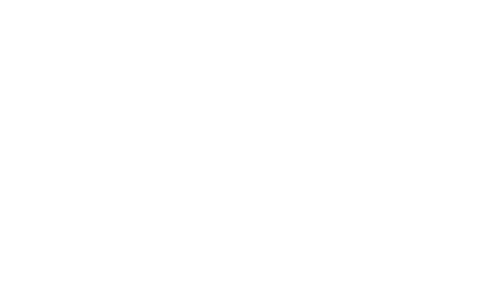

# Enter the Vibe

An interactive audio-visual experience that displays a dynamic credits sequence synchronized with audio beats. The application creates a cinematic experience similar to movie credits, with names and titles appearing in various layouts that transition in sync with audio. The design is inspired by the film "Enter the Void" with neon aesthetics and smooth animations.



## 🛠️ Technology Stack

- **Build Tool**: Vite - Fast development server and optimized production builds
- **Frontend**: Vanilla JavaScript (ES6+), HTML5, CSS3
- **Audio Processing**: Web Audio API for real-time audio analysis and beat detection
- **Animation**: GSAP (GreenSock Animation Platform) for smooth animations
- **Typography**: Anton font from Fontshare for bold, cinematic styling
- **Package Manager**: npm for dependency management
- **Development**: Hot module replacement and fast refresh with Vite

## 🎵 Features

### Dynamic Credits Sequence
- **Multiple Layout Types**: Single name, grid, row, firstname-lastname, bilingual, hierarchical, and title layouts
- **Dynamic Typography**: Responsive font sizes using clamp() for optimal viewing on any device
- **Visual Effects**: Electric glow, flicker, and glitch effects for enhanced visual appeal

### Audio Processing & Beat Detection
- **Real-time Audio Analysis**: Web Audio API integration with frequency analysis
- **Customizable Beat Detection**: Adjustable frequency range focus (bass, mids, highs, full spectrum)
- **Dynamic Peak Detection**: Configurable sensitivity and noise gate threshold


### Interactive Controls
- Beat detection sensitivity and frequency range adjustment
- Display timing control (0.1s to 2s per screen)
- Real-time audio visualization with spectrum analyzer

## 🚀 Getting Started

### Prerequisites
- Node.js (version 16 or higher)
- npm (comes with Node.js)
- Modern web browser with Web Audio API support

### Installation
1. Clone the repository:
   ```bash
   git clone https://github.com/your-username/enter-the-vibe.git
   cd enter-the-vibe
   ```

2. Install dependencies:
   ```bash
   npm install
   ```

3. Start the development server:
   ```bash
   npm run dev
   ```

4. Open your browser and navigate to the URL shown in the terminal (typically `http://localhost:5173`)

### Building for Production
To build the project for production:
```bash
npm run build
```

The built files will be in the `dist` directory, ready for deployment.

### Development Scripts
- `npm run dev` - Start development server with hot reload
- `npm run build` - Build for production
- `npm run preview` - Preview production build locally

## 📁 Project Structure

```
enter-the-vibe/
├── public/                   # Static assets served by Vite
│   ├── salon/               # Salon branding assets
│   │   └── salondrop.svg    # Salon logo
│   ├── zuse/                # Historical computer images
│   │   ├── wp622e3589_05_06.jpg
│   │   ├── wp5597592a_05_06.jpg
│   │   └── wpdc2de409_05_06.jpg
│   ├── sounds/              # Audio files
│   │   ├── Enter-the-Void.mp3
│   └── enter-the-vibe-preview.png
├── src/                     # Source code
│   ├── script.js            # Main application logic
│   ├── style.css            # Styling and animations
│   └── index.html           # HTML template
├── data/                    # Configuration files
│   ├── app-config.json      # Application settings
│   └── credits.json         # Credits data structure
├── docs/                    # Documentation
│   ├── app-overview.md      # Detailed app documentation
│   └── README.md            # Data directory info
├── dist/                    # Built files (generated)
├── node_modules/            # Dependencies (generated)
├── package.json             # Project dependencies and scripts
├── package-lock.json        # Dependency lock file
├── vite.config.js           # Vite configuration
├── index.html               # Main HTML entry point
└── README.md                # This file
```

## 🎮 Usage

### Starting the Experience
1. Click the "START EXPERIENCE" button on the start screen
2. Audio will begin playing automatically
3. Credits sequence will start with Phase 1

### Controlling Beat Detection
- **Peak Threshold**: Adjust sensitivity to audio peaks
- **Noise Floor**: Set minimum audio level threshold
- **Frequency Range**: Focus on bass, mids, highs, or full spectrum
- **Display Time**: Control how long each screen is displayed (0.1s to 2s)

### Manual Controls
- **Spacebar or Click**: Trigger manual beats

- **Skip**: Jump directly to Phase 3 (Digital Landscape)
- **Restart**: Reset the entire experience

## 🎨 Customization

### Credits Data
Edit `data/credits.json` to customize the credits sequence:
- Add new names and descriptions
- Organize by categories and eras
- Configure different layout types
- Set special effects for specific entries

### App Configuration
Modify `data/app-config.json` to adjust:
- Audio processing parameters
- Display timing settings
- Font sizes and layouts
- Beat detection sensitivity

### Visual Styling
Customize the appearance in `src/style.css`:
- Color schemes and neon effects
- Typography and font sizes
- Animation timing and effects
- Layout positioning

## 🔧 Technical Details

### Audio Processing
- Uses Web Audio API for real-time frequency analysis
- Configurable frequency range analysis (0-120 bins)
- Dynamic threshold calculation with energy smoothing
- Noise gate filtering for clean beat detection

### Beat Detection Algorithm
1. Audio processed through analyzer node
2. Frequency data analyzed within configurable range
3. Signal energy calculated with weighted average
4. Dynamic threshold based on recent peak values
5. Beats detected when energy exceeds threshold
6. Minimum time between beats prevents false positives

### Layout System
- **Single Name**: Large typography for individual credits
- **Grid Layout**: 2x2 or 3x2 arrangements for multiple names
- **Row Layout**: Horizontal arrangements with descriptions
- **Bilingual**: Multi-language support with appropriate styling
- **Hierarchical**: Category headers with subordinate names
- **Title**: Large centered text for section headers

## 🎵 Audio Requirements

The application expects audio files in the `public/sounds/` directory:
- `Enter-the-Void.mp3` - Main soundtrack
- `glitch-sound.mp3` - Effect sound for transitions
- `transition-sound.mp3` - Phase transition sound

## 🌐 Browser Compatibility

- Chrome 66+ (recommended)
- Firefox 60+
- Safari 11.1+
- Edge 79+

Requires Web Audio API support for full functionality.

## 📱 Responsive Design

The application adapts to different screen sizes:
- Desktop: Full feature set with detailed controls
- Tablet: Optimized layouts and touch-friendly controls
- Mobile: Simplified interface with essential features

## 🤝 Contributing

1. Fork the repository
2. Create a feature branch (`git checkout -b feature/amazing-feature`)
3. Commit your changes (`git commit -m 'Add amazing feature'`)
4. Push to the branch (`git push origin feature/amazing-feature`)
5. Open a Pull Request

## 📄 License

This project is licensed under the MIT License - see the [LICENSE](LICENSE) file for details.

## 🙏 Acknowledgments

- Inspired by the visual aesthetics of "Enter the Void"
- Built with Web Audio API and GSAP animations
- Uses Anton font family for typography
- Special thanks to all contributors in the credits sequence

---

**Enter the Vibe** - An immersive audio-visual experience that transforms credits into art. 